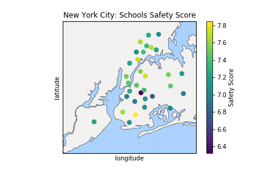

# *Analysing NYC High School Data*

***In this mini-project, we will analyse NYC High School Data and try to find if there is any racial, gender or economic bias in the U.S. Educational System.  We will compile data from various sources and try to find out correlations.***

[Github Repo](https://github.com/nveenverma/Projects/tree/master/Analysing%20NYC%20High%20School%20Data) | [Notebook Preview (nbviewer)](https://nbviewer.jupyter.org/github/nveenverma/Projects/blob/master/Analysing%20NYC%20High%20School%20Data/Schools.ipynb)

---

Following Packages and Concepts are explored:

- *Pandas - DataFrame (Consolidating Data)*
- *Matplotlib, Basemap - Visualisation*
- *Regex - Data Cleaning*

---

> Map displaying Safety Score of Schools in various parts of New York. 
>

