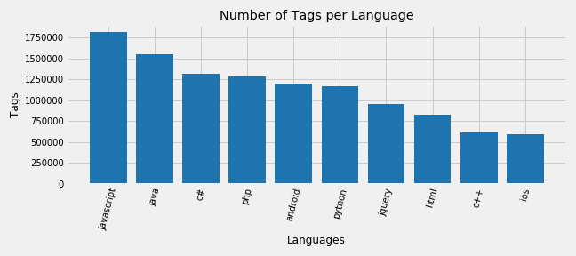

# *Exploring Stack Overflow*

***In this mini-project, we will list down the most tagged languages in StackOverflow. We will also list top voted question alongwith it's top answer for each language.***

To do so, we will scrape the `StackOverflow Website's Tags` [Page](https://stackoverflow.com/tags?tab=popular).

[Github Repo](https://github.com/nveenverma/Projects/tree/master/Exploring%20StackOverflow) | [Notebook Preview (nbviewer)](https://nbviewer.jupyter.org/github/nveenverma/Projects/blob/master/Exploring%20StackOverflow/main.ipynb)

--- 

Following Packages are used:

- *Pandas - DataFrame (Consolidating Data)*
- *Matplotlib - Visualisation*
- *BeautifulSoup - Web Scraping*

---
> Tags Per Language  

---

Inspiration:
- amrrs Github [Repo](https://github.com/amrrs/Scraper-Projects/tree/master/Stack%20Overflow%20Tag%20Count)
- Dataquest [Blog](https://www.dataquest.io/blog/web-scraping-tutorial-python/)

