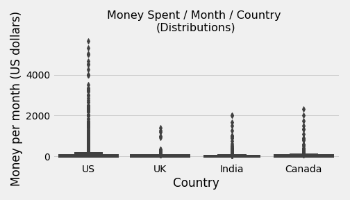

# *Finding the Best Markets to Advertise in an E-Learning Product*

***In this mini-project, we'll explore data from [FreeCodeCamp Survey](https://medium.freecodecamp.org/we-asked-20-000-people-who-they-are-and-how-theyre-learning-to-code-fff5d668969).  We're working for an e-learning company that offers courses on programming. Most of our courses are on web and mobile development, but we also cover many other domains, like data science, game development, etc. We aim to find the two best markets to advertise our product in.***

[Github Repo](https://github.com/nveenverma/Projects/tree/master/Finding%20the%20Best%20Markets%20to%20Advertise%20In) | [Notebook Preview (nbviewer)](https://nbviewer.jupyter.org/github/nveenverma/Projects/blob/master/Finding%20the%20Best%20Markets%20to%20Advertise%20In/main.ipynb)

--- 

Following Packages and Concepts are explored:

- *Pandas - DataFrame (Consolidating Data)*
- *Matplotlib, Seaborn - Visualisation*

---
> Money Spent Per Month Per Country (Distributions)  
>