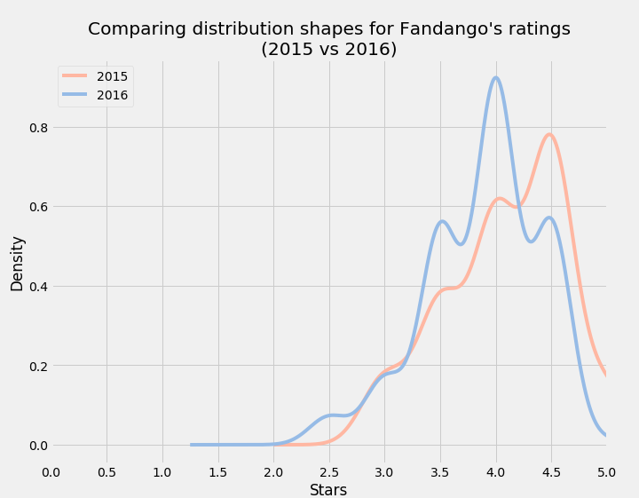
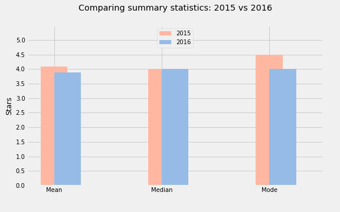

# *Investigating Fandango Movie Ratings*

***In October 2015, Walt Hickey from FiveThirtyEight published a popular article where he presented strong evidence which suggest that Fandango's movie rating system was biased and dishonest.   In this mini-project, we'll analyze more recent movie ratings data to determine whether there has been any change in Fandango's rating system after Hickey's analysis.***

--- 

Following Packages are used:

- *Pandas - DataFrame (Consolidating Data)*
- *Matplotlib - Visualisation*

---
> Ratings (2015 vs 2016)  

> Summary Statistics 
