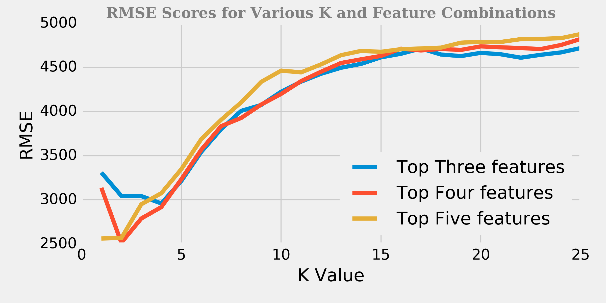

# *Predicting Car Prices*

***In this mini-project, we will be working with dataset on various cars. It contains information/technical aspects of the vehicle such as the motor's displacement, the weight of the car, the miles per gallon, how fast the car accelerates, and more.  We will predict a car's market price using its attributes and cover concepts like `K-Nearest Neighbors, Feature Engineering, Hyperparameter Tuning, RMSE, Cross Validation.`***

[Github Repo](https://github.com/nveenverma/Projects/tree/master/Predicting%20Car%20Prices) | [Notebook Preview (nbviewer)](https://nbviewer.jupyter.org/github/nveenverma/Projects/blob/master/Predicting%20Car%20Prices/main.ipynb)

--- 

Following Packages and Concepts are explored:

- *Pandas - DataFrame (Consolidating Data)*
- *Matplotlib - Visualisation*
- *Scikit-Learn - Modelling and Prediction*

----

> RMSE Scores  

