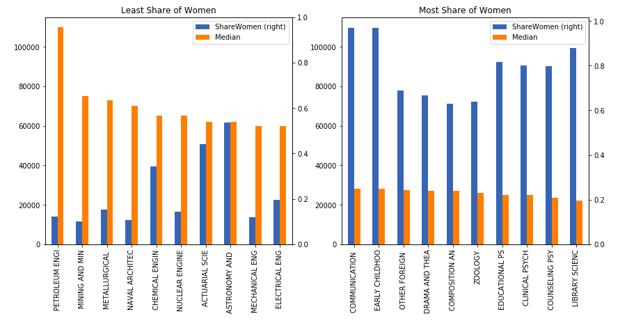

# *Visualising Earnings Based On College Majors*

***In this mini-project, we will work with data taken from FiveThirtyEight (Github), on the job outcomes of students who graduated from college between 2010 and 2012.  We will learn to visualise data using Histograms, ScatterPlots, ScatterMatrix Plots and Bar Charts to see if useful insights can be drawn from them.***

--- 

Following Packages are used:

- *Pandas - DataFrame (Consolidating Data)*
- *Matplotlib - Visualisation*

---
> Share of Women vs Median Salary  

